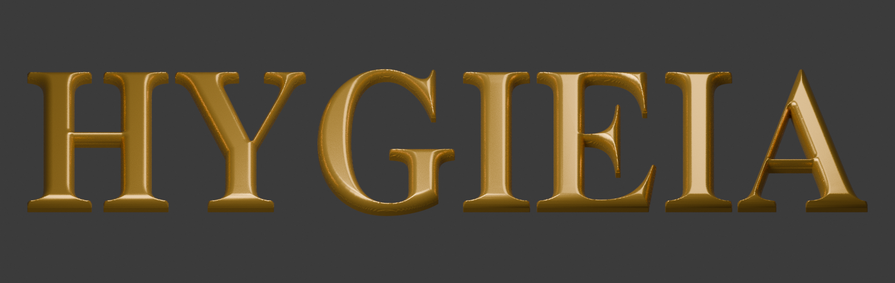

# HYGIEIA — округлые буквы без подложки

Исправленная модель для 3D-печати: семь отдельных букв с округлым верхом и плоской обратной стороной. Общий размер надписи приблизительно **200 × 40 × 5 мм**. Подложки нет.

- [Скачать общий STL](https://github.com/Makismax2020/-/raw/refs/heads/main/downloads/HYGIEIA_rounded_no_base_200mm.stl)
- [Скачать ZIP — общий STL, отдельные буквы, превью и исходники](https://github.com/Makismax2020/-/raw/refs/heads/main/downloads/HYGIEIA_rounded_no_base.zip)
- [Открыть превью](HYGIEIA_rounded_preview.png)

В общем STL буквы расположены как в надписи, но не соединены. Для печати по одной букве используйте отдельные STL в архиве. Положить плоским низом на стол принтера, импортировать в миллиметрах. Для сопла 0,4 мм начальный профиль: слой 0,12–0,16 мм, 3 периметра, заполнение 15–20%.

Все восемь STL проверены: замкнутые, с согласованной ориентацией, без открытых рёбер, дублирующихся и вырожденных треугольников. Геометрическое скругление сохранено в STL. Физическая печать не выполнялась. Золотой цвет относится только к превью. Контуры взяты из предыдущей модели Nimbus Roman Bold, ширина букв масштабирована с 194 до 200 мм.
